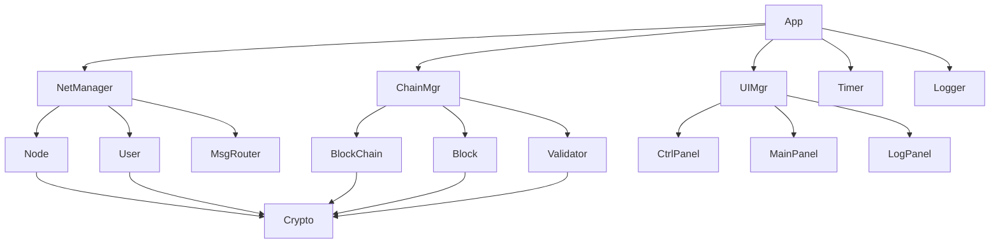

# 设计文档

## 概述

P2P 区块链 Playground 是一个基于 Web 的交互式演示系统，用于模拟和可视化分布式网络中的区块链传输、验证和安全机制。系统采用客户端 JavaScript 实现，使用面向对象的设计模式，提供实时的网络状态可视化和交互控制功能。

### 核心特性
- 模拟 P2P 网络环境（m 个节点，n 个虚拟用户）
- 基于密码学的身份验证和数据签名
- 区块链创建、转移和验证机制
- 双花攻击检测和安全防护
- 实时网络状态可视化
- 交互式控制和参数调整

## 架构

### 整体架构

系统采用单页面应用（SPA）架构，主要包含以下层次：

```
┌─────────────────────────────────────────┐
│              用户界面层                    │
│  ┌─────────────┬─────────────┬─────────────┐ │
│  │  控制面板    │   主面板     │   日志面板   │ │
│  └─────────────┴─────────────┴─────────────┘ │
├─────────────────────────────────────────┤
│              业务逻辑层                    │
│  ┌─────────────┬─────────────┬─────────────┐ │
│  │ 网络管理器   │ 区块链管理器  │  验证引擎   │ │
│  └─────────────┴─────────────┴─────────────┘ │
├─────────────────────────────────────────┤
│              数据模型层                    │
│  ┌─────────────┬─────────────┬─────────────┐ │
│  │    节点      │   虚拟用户   │   区块链    │ │
│  └─────────────┴─────────────┴─────────────┘ │
├─────────────────────────────────────────┤
│              工具服务层                    │
│  ┌─────────────┬─────────────┬─────────────┐ │
│  │  密码学服务  │  时间管理器  │  日志系统   │ │
│  └─────────────┴─────────────┴─────────────┘ │
└─────────────────────────────────────────┘
```

### 模块依赖关系



## 组件和接口

### 核心组件

#### 1. App（主应用类）
```javascript
class App {
    constructor( config )
    
    // 系统控制
    Start()
    Pause()
    Resume()
    Stop()
    
    // 配置管理
    UpdateCfg( newConfig )
    
    // 攻击模拟
    Attack( userId, chainId )
}
```

#### 2. NetManager（网络管理器）
```javascript
class NetManager {
    constructor( nodeCount, userCount, maxConn, failRate )
    
    // 网络初始化
    InitNet()
    
    // 连接管理
    EstabConn()
    UpdateRate( newRate )
    
    // 消息传播
    Broadcast( msg, srcNodeId )
    
    // 网络状态
    GetStatus()
}
```

#### 3. Node（网络节点）
```javascript
class Node {
    constructor( id )
    
    // 身份验证
    GenKeyPair()
    VerifyNodeSig( signature, data, publicKey )
    
    // 连接管理
    ConnectTo( otherNode )
    Disconnect( nodeId )
    
    // 消息处理
    ReceiveMsg( message )
    ForwardMsg( message, excludeNodeId )
    
    // 区块验证
    ValidateBlock( block )
    ValidateChain( blockchain, block )
}
```

#### 4. User（虚拟用户）
```javascript
class User {
    constructor( id )
    
    // 身份管理
    GenKeyPair()
    GetPubKey()
    
    // 区块链操作
    CreateTransBlock( blockchainId, targetUserId )
    SignData( data )
    
    // 资产管理
    GetOwnedChains()
    GetTotalAsset()
}
```

#### 5. BlockChain（区块链）
```javascript
class BlockChain {
    constructor( definition, serialNumber )
    
    // 区块链初始化
    CreateRootBlock( definition, serialNumber )
    CreateOwnerBlock( ownerId )
    
    // 区块管理
    AddBlock( block )
    GetBlock( blockId )
    GetLatestBlock()
    
    // 验证
    ValidateChain()
    DetectFork( newBlock )
    
    // 属性
    GetId()
    GetCurOwner()
    GetValue()
}
```

#### 6. Block（区块）
```javascript
class Block {
    constructor( data, prevBlockId, creatorId, timestamp )
    
    // 区块创建
    GenId()
    SignBlock( privateKey )
    
    // 验证
    VerifySig( publicKey )
    VerifyTime( curTime, maxDelay )
    
    // 属性
    GetId()
    GetData()
    GetCreator()
    GetTime()
}
```

#### 7. Validator（验证引擎）
```javascript
class Validator {
    constructor()
    
    // 密码学验证
    VerifySig( block )
    
    // 区块链完整性验证
    VerifyChainIntegrity( blockchain, block )
    
    // 合法性验证
    ValidateLegality( block, blockchain, network )
    
    // 接收验证
    ValidateReception( block, recvTime )
    
    // 双花检测
    DetectDoubleSpend( block, blockchain )
}
```

### 用户界面组件

#### 8. UIManager（界面管理器）
```javascript
class UIManager {
    constructor( app )
    
    // 界面初始化
    InitUI()
    
    // 面板管理
    UpdateControlPanel()
    UpdateMainPanel()
    UpdateLogPanel()
    
    // 交互处理
    HandleUserClick( element, data )
    HandleMouseOver( element, data )
    
    // Base64 验证代码显示
    ShowVerifyCode( base64Data, dataType )
}
```

#### 9. CtrlPanel（控制面板）
```javascript
class CtrlPanel {
    constructor( uiManager )
    
    // 控制按钮
    RenderCtrlBtns()
    
    // 参数设置
    RenderSettings()
    RenderChainDef()
    
    // 运行时控制
    RenderRuntimeCtrls()
    RenderTickSlider()
}
```

#### 10. MainPanel（主面板）
```javascript
class MainPanel {
    constructor( uiManager )
    
    // 用户资产显示
    RenderUserAssets()
    
    // 区块链归属显示
    RenderChainOwnership()
    
    // 详细信息显示
    ShowUserDetails( userId )
    ShowChainDetails( blockchainId )
}
```

#### 11. LogPanel（日志面板）
```javascript
class LogPanel {
    constructor( uiManager )
    
    // 日志显示
    RenderLogs( logs, filter )
    
    // 分页管理
    Pagination()
    
    // 过滤功能
    FilterLogs( { userId: 2, chainId: 4 } )
    //FilterLogsByChain( blockchainId )
}
```

### 服务组件

#### 12. Crypto（密码学服务）
```javascript
class Crypto {
    // 密钥生成
    static GenKeyPair()
    
    // 签名和验证
    static Sign( data, privateKey )
    static Verify( signature, data, publicKey )
    
    // 哈希计算
    static Sha256( data )
    
    // Base64 编码
    static ToBase64( data )
    static FromBase64( base64String )
    
    // 验证代码生成
    static GenVerifyCode( data, dataType )
}
```

#### 13. Timer（时间管理器）
```javascript
class Timer {
    constructor()
    
    // 滴答管理
    Start()
    Pause()
    Resume()
    Stop()
    
    // 时间控制
    SetTickInterval( milliseconds )
    GetCurrentTick()
    
    // 网络延迟模拟
    CalcNetDelay()
    CalcBroadcastTime( networkParams )
}
```

#### 14. Logger（日志系统）
```javascript
class Logger {
    constructor()
    
    // 日志记录
    Log( type, message, relatedData )
    
    // 日志查询
    GetLogs( filter, page, pageSize )
    GetLogsByUser( userId )
    GetLogsByChain( blockchainId )
    
    // 日志类型
    // - BLOCK_ADDED
    // - BLOCK_ACCEPTED
    // - BLOCK_REJECTED
    // - FORK_WARNING
    // - USER_BLACKLISTED
}
```

## 数据模型

### 核心数据结构

#### 网络配置
```javascript
const NetworkConfig = {
    nodeCount: Number,
    userCount: Number,
    maxConns: Number,
    failureRate: Number,
    paymentRate: Number,
    tickInterval: Number
}
```

#### 区块链定义
```javascript
const ChainDef = {
    desc: String,
    ranges: [
        {
            start: Number,
            end: Number,
            value: Number
        }
    ],
    defHash: String
}
```

#### 区块数据结构
```javascript
const BlockData = {
    // 根区块
    root: {
        definitionHash: String,
        serialNumber: String
    },
    
    // 所有权区块
    ownership: {
        ownerId: String
    },
    
    // 转移区块
    transfer: {
        blockchainId: String,
        previousBlockId: String,
        targetUserId: String,
        timestamp: Number
    }
}
```

#### 消息格式
```javascript
const NetworkMessage = {
    type: String, // 'BLOCK_BROADCAST', 'FORK_WARNING', 'BLACKLIST_UPDATE'
    sourceNodeId: String,
    data: Object,
    dida: Number, // for time
    signature: String
}
```

### 状态管理

#### 全局状态
```javascript
const GlobalState = {
    isRunning: Boolean,
    isPaused: Boolean,
    currentTick: Number,
    
    network: {
        nodes: Map<String, Node>,
        users: Map<String, VirtualUser>,
        connections: Map<String, Set<String>>,
        blacklist: Set<String>
    },
    
    blockchains: Map<String, Blockchain>,
    
    ui: {
        selectedUser: String,
        selectedBlockchain: String,
        selectedLog: String,
        currentView: String
    }
}
```

## 错误处理

### 错误类型定义

```javascript
class PlaygroundError extends Error {
    constructor( type, message, details )
}

// 错误类型
const ErrorTypes = {
    CRYPTO_ERROR: 'CRYPTO_ERROR',
    NETWORK_ERROR: 'NETWORK_ERROR',
    VALIDATION_ERROR: 'VALIDATION_ERROR',
    CONFIG_ERROR: 'CONFIG_ERROR',
    UI_ERROR: 'UI_ERROR'
}
```

### 错误处理策略

1. **密码学错误**：记录错误日志，显示用户友好的错误信息，断开与传来错误区块的节点的连接
2. **网络错误**：模拟网络故障，按照故障率处理
3. **验证错误**：拒绝无效区块，记录安全事件，断开与传来错误区块的节点的连接
4. **配置错误**：阻止系统启动，提示配置修正
5. **界面错误**：优雅降级，保持核心功能可用

## 测试策略

### 单元测试

- **密码学服务测试**：验证签名、哈希、密钥生成的正确性
- **区块链逻辑测试**：测试区块创建、验证、链式结构
- **网络通信测试**：模拟消息传播、连接管理
- **验证引擎测试**：测试各种验证场景和边界条件

### 集成测试

- **端到端流程测试**：完整的区块链转移流程
- **安全机制测试**：双花攻击检测和防护
- **网络故障测试**：连接中断和恢复场景
- **性能测试**：大规模网络和高频交易场景

### 用户界面测试

- **交互功能测试**：点击、悬停、输入等用户操作
- **数据显示测试**：各种数据格式的正确显示
- **响应性测试**：不同屏幕尺寸的适配
- **可访问性测试**：键盘导航和屏幕阅读器支持

## 性能优化

### 计算优化

1. **增量验证**：只验证新增区块，缓存已验证的区块链状态
2. **异步处理**：使用 Web Workers 处理密码学计算
3. **数据结构优化**：使用 Map 和 Set 提高查找效率
4. **内存管理**：及时清理不需要的数据和事件监听器

### 渲染优化

1. **虚拟滚动**：日志面板使用虚拟滚动处理大量数据
2. **防抖和节流**：限制高频更新操作
3. **批量更新**：合并多个 DOM 操作
4. **CSS 动画**：使用 CSS 而非 JavaScript 实现动画效果

### 网络模拟优化

1. **事件驱动**：使用事件队列管理网络消息
2. **优先级队列**：高优先级消息（如安全警告）优先处理
3. **连接池管理**：复用连接对象，减少创建开销
4. **消息去重**：避免重复处理相同消息

## 安全考虑

### 密码学安全

1. **密钥管理**：使用 Web Crypto API 生成和管理密钥
2. **签名验证**：严格验证所有数字签名
3. **哈希完整性**：使用 SHA-256 确保数据完整性
4. **随机数生成**：使用密码学安全的随机数生成器

### 网络安全

1. **消息验证**：验证所有网络消息的来源和完整性
2. **重放攻击防护**：使用时间戳和序列号防止重放
3. **拒绝服务防护**：限制消息频率和大小
4. **恶意节点检测**：监控异常行为并及时隔离

### 应用安全

1. **输入验证**：严格验证所有用户输入
2. **XSS 防护**：对所有显示内容进行转义
3. **CSP 策略**：实施内容安全策略
4. **错误信息安全**：避免泄露敏感信息

## 部署和维护

### 构建配置

```javascript
// webpack.config.js 示例配置
module.exports = {
    entry: './src/index.js',
    output: {
        filename: 'playground.bundle.js',
        path: path.resolve(__dirname, 'dist')
    },
    module: {
        rules: [
            {
                test: /\.js$/,
                use: 'babel-loader'
            },
            {
                test: /\.css$/,
                use: ['style-loader', 'css-loader']
            }
        ]
    },
    optimization: {
        minimize: true
    }
}
```

### 监控和调试

1. **性能监控**：监控关键操作的执行时间
2. **错误追踪**：记录和分析运行时错误
3. **用户行为分析**：跟踪用户交互模式
4. **调试工具**：提供开发者调试接口

### 文档和支持

1. **API 文档**：详细的接口文档和使用示例
2. **用户手册**：面向最终用户的操作指南
3. **开发者指南**：代码结构和扩展指南
4. **故障排除**：常见问题和解决方案