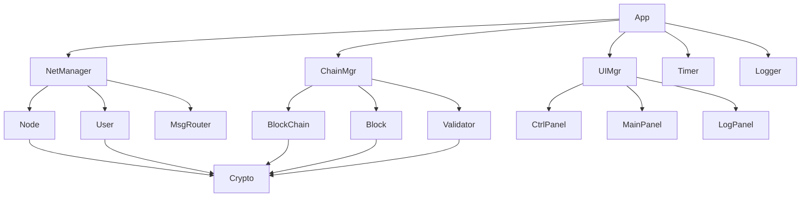

# Design Document

## Overview

The P2P Blockchain Playground is a web-based interactive demonstration system for simulating and visualizing blockchain transfers, validation, and security mechanisms in a distributed network. The system is implemented in client-side JavaScript, using object-oriented design patterns, and provides real-time network status visualization and interactive control features.

### Core Features
- Simulation of a P2P network environment (m nodes, n virtual users)
- Cryptography-based identity verification and data signing
- Blockchain creation, transfer, and validation mechanisms
- Double-spend attack detection and security protection
- Real-time network status visualization
- Interactive control and parameter adjustment

## Architecture

### Overall Architecture

The system uses a Single Page Application (SPA) architecture, primarily consisting of the following layers:

```
┌─────────────────────────────────────────┐
│              User Interface Layer           │
│  ┌─────────────┬─────────────┬─────────────┐ │
│  │ Control Panel │   Main Panel    │   Log Panel     │ │
│  └─────────────┴─────────────┴─────────────┘ │
├─────────────────────────────────────────┤
│              Business Logic Layer           │
│  ┌─────────────┬─────────────┬─────────────┐ │
│  │ Network Manager│ Blockchain Manager│ Validation Engine│ │
│  └─────────────┴─────────────┴─────────────┘ │
├─────────────────────────────────────────┤
│              Data Model Layer               │
│  ┌─────────────┬─────────────┬─────────────┐ │
│  │    Node      │  Virtual User   │   Blockchain    │ │
│  └─────────────┴─────────────┴─────────────┘ │
├─────────────────────────────────────────┤
│              Utility Service Layer          │
│  ┌─────────────┬─────────────┬─────────────┐ │
│  │ Crypto Service│  Timer Manager  │  Logging System │ │
│  └─────────────┴─────────────┴─────────────┘ │
└─────────────────────────────────────────┘
```

### Module Dependency Relationship



## Components and Interfaces

### Core Components

#### 1. App (Main Application Class)
```javascript
class App {
    constructor( config )
    
    // System Control
    Start()
    Pause()
    Resume()
    Stop()
    
    // Configuration Management
    UpdateCfg( newConfig )
    
    // Attack Simulation
    Attack( userId, chainId )
}
```

#### 2. NetManager (Network Manager)
```javascript
class NetManager {
    constructor( nodeCount, userCount, maxConn, failRate )
    
    // Network Initialization
    InitNet()
    
    // Connection Management
    EstabConn()
    UpdateRate( newRate )
    
    // Message Propagation
    Broadcast( msg, srcNodeId )
    
    // Network Status
    GetStatus()
}
```

#### 3. Node (Network Node)
```javascript
class Node {
    constructor( id )
    
    // Identity Verification
    GenKeyPair()
    VerifyNodeSig( signature, data, publicKey )
    
    // Connection Management
    ConnectTo( otherNode )
    Disconnect( nodeId )
    
    // Message Handling
    ReceiveMsg( message )
    ForwardMsg( message, excludeNodeId )
    
    // Block Validation
    ValidateBlock( block )
    ValidateChain( blockchain, block )
}
```

#### 4. User (Virtual User)
```javascript
class User {
    constructor( id )
    
    // Identity Management
    GenKeyPair()
    GetPubKey()
    
    // Blockchain Operations
    CreateTransBlock( blockchainId, targetUserId )
    SignData( data )
    
    // Asset Management
    GetOwnedChains()
    GetTotalAsset()
}
```

#### 5. BlockChain
```javascript
class BlockChain {
    constructor( definition, serialNumber )
    
    // Blockchain Initialization
    CreateRootBlock( definition, serialNumber )
    CreateOwnerBlock( ownerId )
    
    // Block Management
    AddBlock( block )
    GetBlock( blockId )
    GetLatestBlock()
    
    // Validation
    ValidateChain()
    DetectFork( newBlock )
    
    // Properties
    GetId()
    GetCurOwner()
    GetValue()
}
```

#### 6. Block
```javascript
class Block {
    constructor( data, prevBlockId, creatorId, timestamp )
    
    // Block Creation
    GenId()
    SignBlock( privateKey )
    
    // Validation
    VerifySig( publicKey )
    VerifyTime( curTime, maxDelay )
    
    // Properties
    GetId()
    GetData()
    GetCreator()
    GetTime()
}
```

#### 7. Validator (Validation Engine)
```javascript
class Validator {
    constructor()
    
    // Cryptographic Validation
    VerifySig( block )
    
    // Blockchain Integrity Validation
    VerifyChainIntegrity( blockchain, block )
    
    // Legality Validation
    ValidateLegality( block, blockchain, network )
    
    // Reception Validation
    ValidateReception( block, recvTime )
    
    // Double Spend Detection
    DetectDoubleSpend( block, blockchain )
}
```

### User Interface Components

#### 8. UIManager (Interface Manager)
```javascript
class UIManager {
    constructor( app )
    
    // UI Initialization
    InitUI()
    
    // Panel Management
    UpdateControlPanel()
    UpdateMainPanel()
    UpdateLogPanel()
    
    // Interaction Handling
    HandleUserClick( element, data )
    HandleMouseOver( element, data )
    
    // Base64 Validation Code Display
    ShowVerifyCode( base64Data, dataType )
}
```

#### 9. CtrlPanel (Control Panel)
```javascript
class CtrlPanel {
    constructor( uiManager )
    
    // Control Buttons
    RenderCtrlBtns()
    
    // Parameter Settings
    RenderSettings()
    RenderChainDef()
    
    // Runtime Controls
    RenderRuntimeCtrls()
    RenderTickSlider()
}
```

#### 10. MainPanel
```javascript
class MainPanel {
    constructor( uiManager )
    
    // User Asset Display
    RenderUserAssets()
    
    // Blockchain Ownership Display
    RenderChainOwnership()
    
    // Detailed Information Display
    ShowUserDetails( userId )
    ShowChainDetails( blockchainId )
}
```

#### 11. LogPanel
```javascript
class LogPanel {
    constructor( uiManager )
    
    // Log Display
    RenderLogs( logs, filter )
    
    // Pagination Management
    Pagination()
    
    // Filtering Functionality
    FilterLogs( { userId: 2, chainId: 4 } )
    //FilterLogsByChain( blockchainId )
}
```

### Service Components

#### 12. Crypto (Cryptography Service)
```javascript
class Crypto {
    // Key Generation
    static GenKeyPair()
    
    // Signing and Verification
    static Sign( data, privateKey )
    static Verify( signature, data, publicKey )
    
    // Hash Calculation
    static Sha256( data )
    
    // Base64 Encoding
    static ToBase64( data )
    static FromBase64( base64String )
    
    // Validation Code Generation
    static GenVerifyCode( data, dataType )
}
```

#### 13. Timer (Time Manager)
```javascript
class Timer {
    constructor()
    
    // Tick Management
    Start()
    Pause()
    Resume()
    Stop()
    
    // Time Control
    SetTickInterval( milliseconds )
    GetCurrentTick()
    
    // Network Delay Simulation
    CalcNetDelay()
    CalcBroadcastTime( networkParams )
}
```

#### 14. Logger (Logging System)
```javascript
class Logger {
    constructor()
    
    // Log Recording
    Log( type, message, relatedData )
    
    // Log Querying
    GetLogs( filter, page, pageSize )
    GetLogsByUser( userId )
    GetLogsByChain( blockchainId )
    
    // Log Types
    // - BLOCK_ADDED
    // - BLOCK_ACCEPTED
    // - BLOCK_REJECTED
    // - FORK_WARNING
    // - USER_BLACKLISTED
}
```

## Data Models

### Core Data Structures

#### Network Configuration
```javascript
const NetworkConfig = {
    nodeCount: Number,
    userCount: Number,
    maxConns: Number,
    failureRate: Number,
    paymentRate: Number,
    tickInterval: Number
}
```

#### Blockchain Definition
```javascript
const ChainDef = {
    desc: String,
    ranges: [
        {
            start: Number,
            end: Number,
            value: Number
        }
    ],
    defHash: String
}
```

#### Block Data Structure
```javascript
const BlockData = {
    // Root Block
    root: {
        definitionHash: String,
        serialNumber: String
    },
    
    // Ownership Block
    ownership: {
        ownerId: String
    },
    
    // Transfer Block
    transfer: {
        blockchainId: String,
        previousBlockId: String,
        targetUserId: String,
        timestamp: Number
    }
}
```

#### Message Format
```javascript
const NetworkMessage = {
    type: String, // 'BLOCK_BROADCAST', 'FORK_WARNING', 'BLACKLIST_UPDATE'
    sourceNodeId: String,
    data: Object,
    dida: Number, // for time
    signature: String
}
```

### State Management

#### Global State
```javascript
const GlobalState = {
    isRunning: Boolean,
    isPaused: Boolean,
    currentTick: Number,
    
    network: {
        nodes: Map<String, Node>,
        users: Map<String, VirtualUser>,
        connections: Map<String, Set<String>>,
        blacklist: Set<String>
    },
    
    blockchains: Map<String, Blockchain>,
    
    ui: {
        selectedUser: String,
        selectedBlockchain: String,
        selectedLog: String,
        currentView: String
    }
}
```

## Error Handling

### Error Type Definitions

```javascript
class PlaygroundError extends Error {
    constructor( type, message, details )
}

// Error Types
const ErrorTypes = {
    CRYPTO_ERROR: 'CRYPTO_ERROR',
    NETWORK_ERROR: 'NETWORK_ERROR',
    VALIDATION_ERROR: 'VALIDATION_ERROR',
    CONFIG_ERROR: 'CONFIG_ERROR',
    UI_ERROR: 'UI_ERROR'
}
```

### Error Handling Strategy

1.  **Crypto Error**: Log the error, display a user-friendly error message, and disconnect from the node that sent the erroneous block.
2.  **Network Error**: Simulate network failures according to the failure rate.
3.  **Validation Error**: Reject invalid blocks, log a security event, and disconnect from the node that sent the erroneous block.
4.  **Configuration Error**: Prevent the system from starting and prompt for configuration correction.
5.  **UI Error**: Graceful degradation, keeping core functionality available.

## Testing Strategy

### Unit Tests

- **Cryptography Service Tests**: Verify the correctness of signatures, hashes, and key generation.
- **Blockchain Logic Tests**: Test block creation, validation, and chain structure.
- **Network Communication Tests**: Simulate message propagation and connection management.
- **Validation Engine Tests**: Test various validation scenarios and edge cases.

### Integration Tests

- **End-to-End Flow Tests**: Complete blockchain transfer process.
- **Security Mechanism Tests**: Double-spend attack detection and prevention.
- **Network Failure Tests**: Connection interruption and recovery scenarios.
- **Performance Tests**: Large-scale network and high-frequency transaction scenarios.

### User Interface Tests

- **Interaction Functionality Tests**: User actions like clicks, hovers, and inputs.
- **Data Display Tests**: Correct display of various data formats.
- **Responsiveness Tests**: Adaptation to different screen sizes.
- **Accessibility Tests**: Keyboard navigation and screen reader support.

## Performance Optimization

### Computation Optimization

1.  **Incremental Validation**: Only validate new blocks and cache the state of already validated blockchains.
2.  **Asynchronous Processing**: Use Web Workers for cryptographic computations.
3.  **Data Structure Optimization**: Use `Map` and `Set` for efficient lookups.
4.  **Memory Management**: Promptly clean up unnecessary data and event listeners.

### Rendering Optimization

1.  **Virtual Scrolling**: Use virtual scrolling in the log panel to handle large amounts of data.
2.  **Debouncing and Throttling**: Limit high-frequency update operations.
3.  **Batch Updates**: Combine multiple DOM operations.
4.  **CSS Animations**: Use CSS instead of JavaScript for animations.

### Network Simulation Optimization

1.  **Event-Driven**: Use an event queue to manage network messages.
2.  **Priority Queue**: Prioritize high-priority messages (e.g., security warnings).
3.  **Connection Pool Management**: Reuse connection objects to reduce creation overhead.
4.  **Message Deduplication**: Avoid processing the same message multiple times.

## Security Considerations

### Cryptographic Security

1.  **Key Management**: Use the Web Crypto API to generate and manage keys.
2.  **Signature Verification**: Strictly verify all digital signatures.
3.  **Hash Integrity**: Use SHA-256 to ensure data integrity.
4.  **Random Number Generation**: Use a cryptographically secure random number generator.

### Network Security

1.  **Message Validation**: Verify the source and integrity of all network messages.
2.  **Replay Attack Prevention**: Use timestamps and sequence numbers to prevent replays.
3.  **Denial of Service Prevention**: Limit message frequency and size.
4.  **Malicious Node Detection**: Monitor for abnormal behavior and isolate offending nodes.

### Application Security

1.  **Input Validation**: Strictly validate all user inputs.
2.  **XSS Prevention**: Escape all displayed content.
3.  **CSP Policy**: Implement a Content Security Policy.
4.  **Error Message Security**: Avoid leaking sensitive information.

## Deployment and Maintenance

### Build Configuration

```javascript
// webpack.config.js example configuration
module.exports = {
    entry: './src/index.js',
    output: {
        filename: 'playground.bundle.js',
        path: path.resolve(__dirname, 'dist')
    },
    module: {
        rules: [
            {
                test: /\.js$/,
                use: 'babel-loader'
            },
            {
                test: /\.css$/,
                use: ['style-loader', 'css-loader']
            }
        ]
    },
    optimization: {
        minimize: true
    }
}
```

### Monitoring and Debugging

1.  **Performance Monitoring**: Monitor the execution time of critical operations.
2.  **Error Tracking**: Log and analyze runtime errors.
3.  **User Behavior Analysis**: Track user interaction patterns.
4.  **Debugging Tools**: Provide a developer debugging interface.

### Documentation and Support

1.  **API Documentation**: Detailed interface documentation and usage examples.
2.  **User Manual**: An operational guide for end-users.
3.  **Developer Guide**: A guide to the code structure and extension.
4.  **Troubleshooting**: Common issues and solutions.
