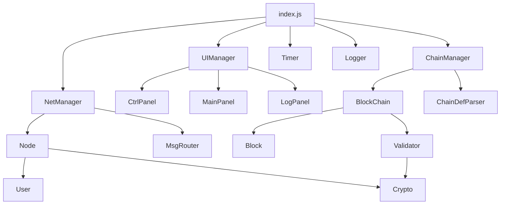
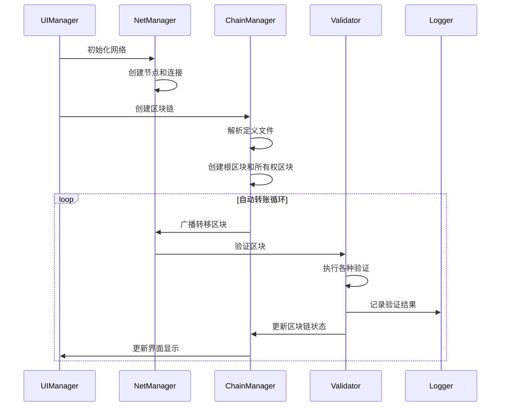

# P2P 区块链 Playground 技术文档

## 项目概述

P2P 区块链 Playground 是一个基于 JavaScript 的 Web 应用程序，用于模拟和演示分布式区块链网络的工作原理。系统采用模块化架构，支持实时网络模拟、区块链验证和安全机制演示。

## 技术栈

### 前端技术
- **JavaScript (ES6+)**：主要编程语言
- **HTML5**：页面结构
- **CSS3**：样式和布局
- **Web Crypto API**：密码学操作

### 开发工具
- **Vitest**：单元测试框架
- **ESLint**：代码质量检查
- **Node.js**：开发环境
- **npm**：包管理器

### 浏览器 API
- **Web Workers**：后台计算（计划中）
- **IndexedDB**：本地存储（计划中）
- **WebRTC**：P2P 通信模拟（计划中）

## 系统架构

### 整体架构图

```
┌─────────────────────────────────────────┐
│              用户界面层                    │
│  ┌─────────────┬─────────────┬─────────────┐ │
│  │  CtrlPanel  │  MainPanel  │  LogPanel   │ │
│  └─────────────┴─────────────┴─────────────┘ │
│              UIManager                      │
├─────────────────────────────────────────┤
│              业务逻辑层                    │
│  ┌─────────────┬─────────────┬─────────────┐ │
│  │ NetManager  │ChainManager │  Validator  │ │
│  └─────────────┴─────────────┴─────────────┘ │
│  ┌─────────────┬─────────────┬─────────────┐ │
│  │AutoTransfer │PaymentRate  │SystemMonitor│ │
│  └─────────────┴─────────────┴─────────────┘ │
├─────────────────────────────────────────┤
│              数据模型层                    │
│  ┌─────────────┬─────────────┬─────────────┐ │
│  │    Node     │    User     │ BlockChain  │ │
│  └─────────────┴─────────────┴─────────────┘ │
│  ┌─────────────┬─────────────┬─────────────┐ │
│  │    Block    │             │             │ │
│  └─────────────┴─────────────┴─────────────┘ │
├─────────────────────────────────────────┤
│              服务层                        │
│  ┌─────────────┬─────────────┬─────────────┐ │
│  │   Crypto    │   Timer     │   Logger    │ │
│  └─────────────┴─────────────┴─────────────┘ │
│  ┌─────────────┬─────────────┬─────────────┐ │
│  │ MsgRouter   │ErrorHandler │PerformOpt   │ │
│  └─────────────┴─────────────┴─────────────┘ │
└─────────────────────────────────────────┘
```

### 模块依赖关系



## 核心模块详解

### 1. 网络层 (Network Layer)

#### NetManager
负责 P2P 网络的初始化、连接管理和消息传播。

**主要功能：**
- 网络拓扑管理
- 节点连接建立和维护
- 消息路由和广播
- 网络故障模拟

**关键方法：**
```javascript
class NetManager {
    async initNetwork()                    // 初始化网络
    async broadcastMessage(msg, sourceId) // 广播消息
    updateNetworkConfig(config)           // 更新网络配置
    getNetworkStatus()                    // 获取网络状态
}
```

#### Node
表示网络中的单个节点，处理节点间通信。

**主要功能：**
- 节点身份验证
- 消息接收和转发
- 连接状态管理
- 本地用户管理

**关键方法：**
```javascript
class Node {
    async genKeyPair()                    // 生成密钥对
    connectTo(otherNode)                  // 连接到其他节点
    receiveMessage(message)               // 接收消息
    forwardMessage(message, excludeId)    // 转发消息
}
```

### 2. 区块链层 (Blockchain Layer)

#### ChainManager
管理所有区块链的创建、转移和状态维护。

**主要功能：**
- 区块链批量创建
- 所有权管理
- 转移操作处理
- 完整性验证

**关键方法：**
```javascript
class ChainManager {
    async createBlockchainsFromDefinition(def, users) // 创建区块链
    async transferBlockchain(chainId, from, to)       // 转移区块链
    getUserBlockchains(userId)                        // 获取用户区块链
    validateIntegrity()                               // 验证完整性
}
```

#### BlockChain
表示单个区块链，管理区块的添加和验证。

**主要功能：**
- 区块添加和验证
- 分叉检测
- 所有权跟踪
- 历史记录维护

**关键方法：**
```javascript
class BlockChain {
    addBlock(block)                       // 添加区块
    validateBlock(block)                  // 验证区块
    detectFork(newBlock)                  // 检测分叉
    getCurrentOwner()                     // 获取当前所有者
}
```

#### Block
表示单个区块，包含数据和验证信息。

**主要功能：**
- 区块数据封装
- 数字签名
- 哈希计算
- 序列化/反序列化

**关键方法：**
```javascript
class Block {
    constructor(data, prevBlockId, creatorId, timestamp)
    signBlock(privateKey)                 // 签名区块
    verifySignature(publicKey)            // 验证签名
    serialize()                           // 序列化
}
```

### 3. 验证层 (Validation Layer)

#### Validator
负责所有区块和区块链的验证逻辑。

**主要功能：**
- 密码学验证
- 区块链完整性检查
- 合法性验证
- 双花攻击检测

**关键方法：**
```javascript
class Validator {
    async verifyBlockSignature(block, publicKey)      // 验证区块签名
    async verifyChainIntegrity(blockchain, block)     // 验证链完整性
    async validateBlockLegality(block, chain, network) // 验证合法性
    async detectDoubleSpend(block, blockchain)        // 检测双花
}
```

### 4. 用户界面层 (UI Layer)

#### UIManager
管理整个用户界面的初始化和更新。

**主要功能：**
- 界面初始化
- 组件协调
- 事件处理
- 数据绑定

**关键方法：**
```javascript
class UIManager {
    initUI()                              // 初始化界面
    updateDisplay()                       // 更新显示
    handleUserInteraction(event)          // 处理用户交互
    showVerifyCode(data, type)            // 显示验证代码
}
```

#### CtrlPanel
控制面板，提供系统配置和控制功能。

**主要功能：**
- 系统控制（开始/暂停/停止）
- 参数配置
- 运行时调整
- 攻击模拟控制

#### MainPanel
主面板，显示网络状态和数据。

**主要功能：**
- 用户资产显示
- 区块链归属显示
- 交互式详情查看
- 实时数据更新

#### LogPanel
日志面板，显示系统操作日志。

**主要功能：**
- 实时日志显示
- 日志分页
- 过滤和搜索
- 详情查看

### 5. 服务层 (Service Layer)

#### Crypto
提供所有密码学操作的统一接口。

**主要功能：**
- 密钥对生成
- 数字签名和验证
- 哈希计算
- Base64 编码/解码

**关键方法：**
```javascript
class Crypto {
    static genKeyPair()                   // 生成密钥对
    static sign(data, privateKey)         // 数字签名
    static verify(signature, data, publicKey) // 验证签名
    static sha256(data)                   // SHA256 哈希
    static toBase64(data)                 // Base64 编码
}
```

#### Timer
时间管理器，控制系统的时间流逝。

**主要功能：**
- 滴答计数
- 时间控制
- 回调管理
- 性能统计

**关键方法：**
```javascript
class Timer {
    start()                               // 启动计时器
    pause()                               // 暂停计时器
    resume()                              // 恢复计时器
    stop()                                // 停止计时器
    onTick(callback)                      // 注册滴答回调
}
```

#### Logger
日志系统，记录和管理系统操作日志。

**主要功能：**
- 日志记录
- 分类管理
- 查询和过滤
- 导出功能

**关键方法：**
```javascript
class Logger {
    log(type, message, relatedData, level) // 记录日志
    getLogs(filter, page, pageSize)        // 获取日志
    getLogsByUser(userId)                   // 按用户获取日志
    exportLogs(filter)                      // 导出日志
}
```

## 数据流和状态管理

### 数据流图



### 状态管理

系统采用事件驱动的状态管理模式：

1. **全局状态**：由主应用管理，包含网络状态、用户状态、区块链状态
2. **组件状态**：各组件维护自己的内部状态
3. **事件通信**：组件间通过事件进行通信
4. **状态同步**：定期同步各组件状态

## 安全机制

### 密码学安全

1. **密钥管理**
   - 使用 Web Crypto API 生成密钥对
   - 私钥仅在内存中存储，不持久化
   - 公钥用作用户和节点标识

2. **数字签名**
   - 所有区块都必须签名
   - 使用 ECDSA 算法
   - 签名验证贯穿整个系统

3. **哈希完整性**
   - 使用 SHA-256 算法
   - 区块链 ID 基于根区块哈希
   - 定义文件哈希确保完整性

### 网络安全

1. **身份验证**
   - 节点连接需要签名验证
   - 消息来源验证
   - 防止身份伪造

2. **消息完整性**
   - 所有网络消息都包含签名
   - 消息篡改检测
   - 重放攻击防护

3. **攻击检测**
   - 双花攻击检测
   - 分叉攻击检测
   - 恶意节点识别和隔离

### 应用安全

1. **输入验证**
   - 严格的参数验证
   - JSON 格式验证
   - 边界值检查

2. **错误处理**
   - 优雅的错误处理
   - 错误信息不泄露敏感数据
   - 异常恢复机制

3. **资源保护**
   - 内存使用限制
   - 计算资源保护
   - 防止拒绝服务攻击

## 性能优化

### 计算优化

1. **缓存机制**
   - 验证结果缓存
   - 计算结果复用
   - 智能缓存失效

2. **异步处理**
   - 密码学操作异步化
   - 网络操作异步化
   - UI 更新异步化

3. **算法优化**
   - 高效的数据结构
   - 优化的搜索算法
   - 减少重复计算

### 内存优化

1. **对象池**
   - 重用频繁创建的对象
   - 减少垃圾回收压力
   - 内存使用监控

2. **数据压缩**
   - 日志数据压缩
   - 网络消息压缩
   - 存储空间优化

3. **内存泄漏防护**
   - 及时清理事件监听器
   - 避免循环引用
   - 定期内存检查

### 渲染优化

1. **虚拟滚动**
   - 大量数据的高效显示
   - 减少 DOM 操作
   - 提高滚动性能

2. **批量更新**
   - 合并多个 DOM 操作
   - 减少重绘和重排
   - 使用 requestAnimationFrame

3. **懒加载**
   - 按需加载组件
   - 延迟初始化
   - 资源优化

## 测试策略

### 单元测试

每个模块都有对应的单元测试：

```
tests/
├── models/           # 数据模型测试
├── services/         # 服务层测试
├── ui/              # 界面组件测试
├── integration/     # 集成测试
└── performance/     # 性能测试
```

### 测试覆盖率

- **目标覆盖率**：90%+
- **关键模块**：100% 覆盖率
- **边界测试**：全面的边界条件测试
- **错误测试**：异常情况测试

### 集成测试

1. **端到端测试**：完整的用户操作流程
2. **系统集成测试**：各模块协同工作
3. **性能集成测试**：系统整体性能
4. **安全集成测试**：安全机制验证

## 部署和构建

### 开发环境

```bash
# 安装依赖
npm install

# 运行测试
npm test

# 代码检查
npm run lint

# 启动开发服务器
npm run dev
```

### 生产构建

```bash
# 构建生产版本
npm run build

# 优化资源
npm run optimize

# 生成文档
npm run docs
```

### 部署配置

1. **静态文件服务**
   - 可部署到任何静态文件服务器
   - 支持 CDN 加速
   - 支持 HTTPS

2. **浏览器兼容性**
   - 现代浏览器支持
   - ES6+ 特性使用
   - Polyfill 支持

3. **性能监控**
   - 运行时性能监控
   - 错误追踪
   - 用户行为分析

## 扩展和定制

### 插件系统

系统支持插件扩展：

1. **验证插件**：自定义验证逻辑
2. **网络插件**：自定义网络行为
3. **UI 插件**：自定义界面组件
4. **分析插件**：自定义数据分析

### 配置系统

支持多层次配置：

1. **默认配置**：系统默认设置
2. **用户配置**：用户自定义设置
3. **运行时配置**：动态配置调整
4. **环境配置**：不同环境的配置

### API 接口

提供编程接口：

1. **核心 API**：系统核心功能接口
2. **事件 API**：事件监听和触发
3. **数据 API**：数据访问和操作
4. **配置 API**：配置管理接口

## 故障排除

### 常见问题

1. **性能问题**
   - 检查网络规模设置
   - 监控内存使用
   - 优化计算密集操作

2. **兼容性问题**
   - 检查浏览器版本
   - 验证 API 支持
   - 使用 Polyfill

3. **功能问题**
   - 查看错误日志
   - 检查配置设置
   - 验证数据格式

### 调试工具

1. **浏览器开发者工具**
   - Console 调试
   - Network 监控
   - Performance 分析

2. **系统内置调试**
   - 详细日志输出
   - 状态检查工具
   - 性能监控面板

3. **测试工具**
   - 单元测试调试
   - 集成测试分析
   - 性能测试工具

## 贡献指南

### 代码规范

1. **JavaScript 规范**
   - 使用 ES6+ 语法
   - 遵循 ESLint 规则
   - 详细的注释说明

2. **命名规范**
   - 类名使用 PascalCase
   - 方法名使用 camelCase
   - 常量使用 UPPER_CASE

3. **文件组织**
   - 模块化设计
   - 清晰的目录结构
   - 合理的文件命名

### 开发流程

1. **Fork 项目**
2. **创建功能分支**
3. **编写代码和测试**
4. **提交 Pull Request**
5. **代码审查**
6. **合并到主分支**

### 测试要求

1. **单元测试**：新功能必须有单元测试
2. **集成测试**：重要功能需要集成测试
3. **文档更新**：更新相关文档
4. **性能测试**：性能敏感功能需要性能测试

## 版本历史

### v1.0.0 (当前版本)
- ✅ 基础 P2P 网络模拟
- ✅ 区块链创建和转移
- ✅ 基本的安全机制
- ✅ 用户界面实现
- ✅ 完整的代码注释和文档
- ✅ 生产环境构建配置
- ✅ 自动化部署验证
- ✅ 代码质量检查工具
- ✅ 性能优化和监控
- ✅ 错误处理和恢复机制

### v1.1.0 (计划中)
- 🔄 性能优化增强
- 🔄 更多攻击场景模拟
- 🔄 增强的分析功能
- 🔄 移动端响应式支持
- 🔄 国际化支持
- 🔄 插件系统架构

### v2.0.0 (规划中)
- 📋 插件系统完整实现
- 📋 高级分析工具
- 📋 多链并行支持
- 📋 云端部署和同步
- 📋 实时协作功能
- 📋 高级可视化

## 部署和维护指南

### 生产环境部署

#### 1. 构建准备
```bash
# 完整的质量检查
npm run quality:full

# 生产构建
npm run build

# 本地验证
npm run verify:local
```

#### 2. 部署执行
```bash
# 部署到静态服务器
npm run deploy:static

# 或手动部署
cp -r dist/* /var/www/html/
```

#### 3. 部署后验证
```bash
# 验证生产环境
npm run verify:prod https://your-domain.com

# 增强验证
npm run verify:enhanced https://your-domain.com
```

### 持续集成/持续部署 (CI/CD)

#### GitHub Actions 示例
```yaml
name: Deploy P2P Blockchain Playground

on:
  push:
    branches: [ main ]

jobs:
  deploy:
    runs-on: ubuntu-latest
    
    steps:
    - uses: actions/checkout@v3
    
    - name: Setup Node.js
      uses: actions/setup-node@v3
      with:
        node-version: '18'
        cache: 'npm'
    
    - name: Install dependencies
      run: npm ci
    
    - name: Run quality checks
      run: npm run quality:full
    
    - name: Build project
      run: npm run build
    
    - name: Deploy to production
      run: npm run deploy
    
    - name: Verify deployment
      run: npm run post-deploy
```

### 监控和维护

#### 性能监控
- 页面加载时间监控
- 资源使用情况跟踪
- 用户交互性能分析
- 错误率统计

#### 日志管理
- 应用程序日志收集
- 错误日志分析
- 性能日志监控
- 用户行为日志

#### 定期维护任务
- 依赖更新检查
- 安全漏洞扫描
- 性能优化评估
- 文档更新维护

## 许可证

本项目采用 MIT 许可证，详见 LICENSE 文件。

## 联系方式

- **项目主页**：[GitHub Repository]
- **问题反馈**：[GitHub Issues]
- **技术讨论**：[Discussion Forum]
- **邮件联系**：[Email Address]